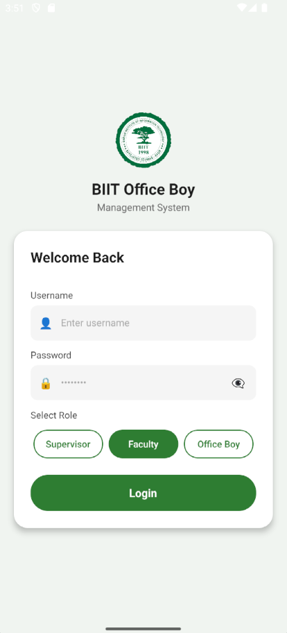
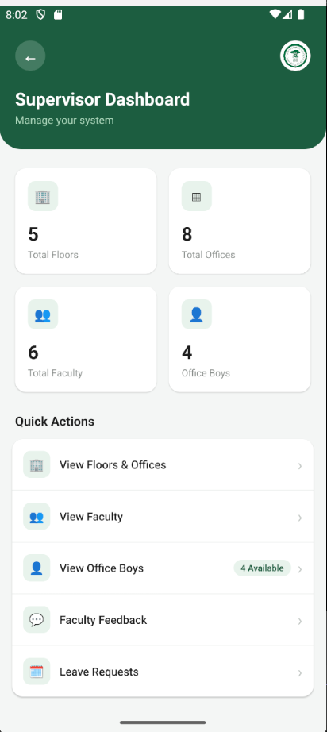
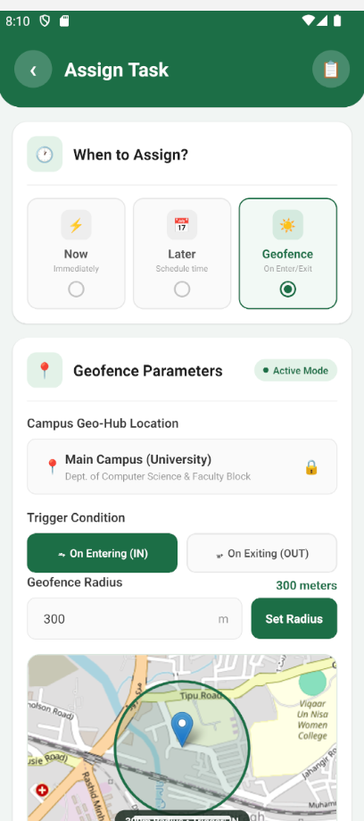
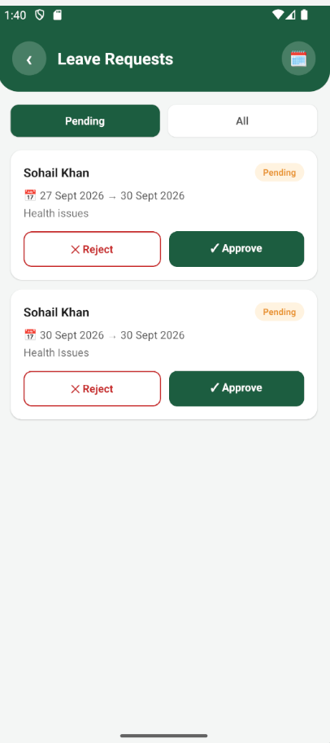
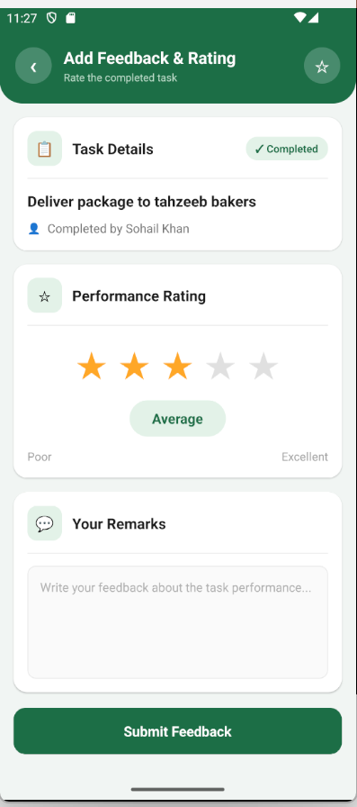
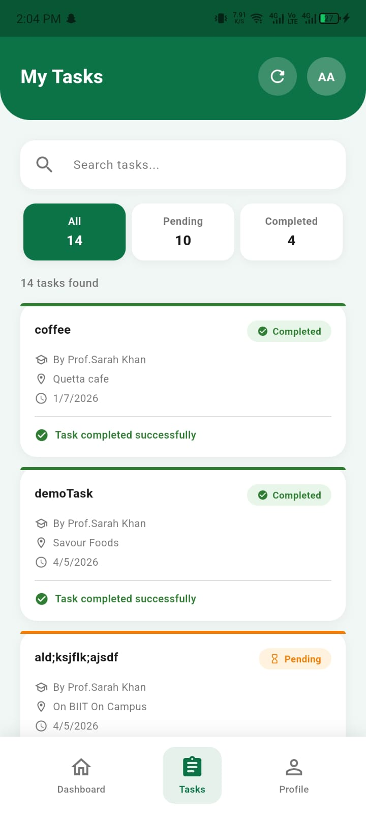
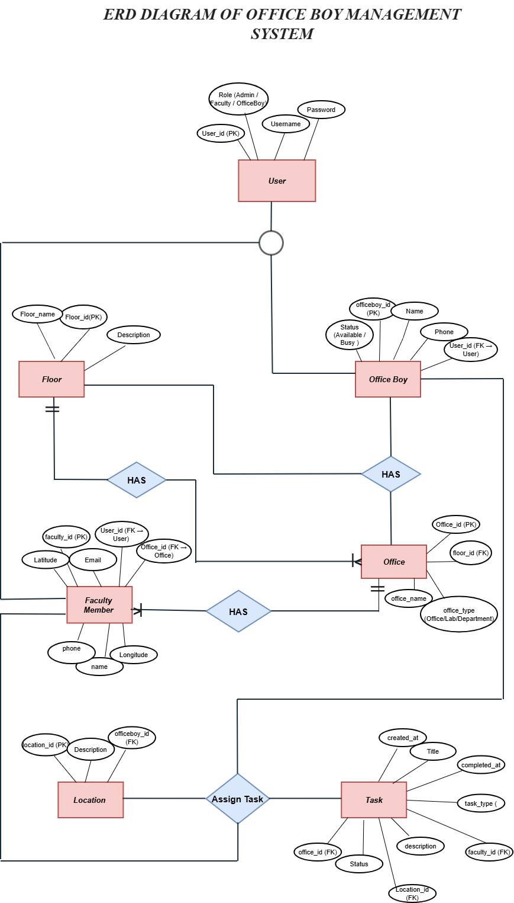

<h1 align="center">Office Boy Management System</h1>

<p align="center">
  A role-based mobile application that digitizes task delegation, staff accountability and leave coverage for a university support-staff team.
</p>

<p align="center">
  
  
  
  
</p>

<p align="center">
  <a href="#overview">Overview</a> ·
  <a href="#features">Features</a> ·
  <a href="#screenshots">Screenshots</a> ·
  <a href="#architecture">Architecture</a> ·
  <a href="#database-and-api">Database and API</a> ·
  <a href="#getting-started">Getting started</a>
</p>

---

## Overview

University departments rely on office boys and support staff for daily operational work such as deliveries, office upkeep and errands. Coordination was manual and informal: faculty had no structured way to assign and track tasks, and supervisors had no visibility into staff workload, performance or availability.

This project replaces that ad-hoc process with a structured, role-based mobile system in which every task, rating and leave request is recorded and visible to the right person.

| | |
|---|---|
| **Project type** | University project at BIIT, built by a team of four |
| **Platform** | Android (React Native) |
| **User roles** | Supervisor, Faculty, Office Boy |
| **Backend** | ASP.NET Core Web API with SQL Server |

## Features

- **Three task modes:** assign a task immediately, schedule it for later, or trigger it by location with a geofence
- **Geofence push alerts:** a Firebase notification reaches the office boy instantly, even when the app is in the background
- **Ratings and review:** faculty rate completed work out of 5 stars, and supervisors review tasks rated 3 or below
- **Leave with automatic coverage:** supervisors approve leave and assign a replacement, and the original assignment is restored when the leave ends
- **Staff rotation:** supervisors reassign office boys between floors and offices, with history preserved
- **In-app messaging:** supervisors can message office boys directly

### What each role does

| Capability | Supervisor | Faculty | Office Boy |
|------------|:----------:|:-------:|:----------:|
| Create and assign tasks | | ✓ | |
| Execute tasks and update status | | | ✓ |
| Rate completed tasks | | ✓ | |
| Review low-rated tasks | ✓ | | |
| Request leave | | | ✓ |
| Approve leave and assign replacement | ✓ | | |
| Reassign staff between floors | ✓ | | |
| Send direct messages | ✓ | | |

## Screenshots

<table>
  <tr>
    <td align="center"><br /><sub>Login with role selection</sub></td>
    <td align="center"><br /><sub>Supervisor dashboard</sub></td>
    <td align="center"><br /><sub>Now, Later and Geofence tasks</sub></td>
  </tr>
  <tr>
    <td align="center"><br /><sub>Leave approval</sub></td>
    <td align="center"><br /><sub>Feedback and rating</sub></td>
    <td align="center"><br /><sub>Office boy task list</sub></td>
  </tr>
</table>

## Architecture

```
React Native app  ──►  ASP.NET Core Web API  ──►  SQL Server
        ▲                      │
        └──── Firebase Cloud Messaging (push notifications)
```

Three authenticated portals share a single backend and database. Every user signs in through one login screen and is routed to a dashboard with permissions scoped to their role.

| Layer | Technology |
|-------|------------|
| Mobile app | React Native (Android), with native integration for GPS and date/time pickers |
| Backend | ASP.NET Core Web API (C#), organized into role-based RESTful controllers |
| Database | Microsoft SQL Server, relational schema with foreign-key-enforced integrity |
| Notifications | Firebase Cloud Messaging |
| Maps | Leaflet and OpenStreetMap for geofence visualization |

### How the main flows work

**Task management.** Faculty create tasks in three modes: *Now*, *Later* (a future date and time) or *Geofence*, where the task activates when the faculty member's live location enters or exits a defined radius around campus. Office boys track tasks through *Pending* and *Completed* states from their dashboard.

**Leave and coverage.** Office boys submit a leave request with a date range and reason. On approval, the supervisor assigns a replacement. The system reassigns coverage and restores the original assignment when the leave period ends, so there is no gap in operations.

**Real-time alerts.** Faculty location is checked live against the campus geofence. When it matches, the backend triggers a Firebase push notification to the relevant office boy.

## Database and API

The schema centers on an `Account` table (role-differentiated through a `Role` field) linked to the `Task`, `LeaveRequest`, `OfficeBoyAssignedFloors` and `Message` tables through enforced foreign keys. This keeps assignments, task history and leave records consistent.

The API exposes granular, role-scoped endpoints that follow REST conventions, with request validation and structured error responses.

| Method | Endpoint | Purpose |
|--------|----------|---------|
| `POST` | `/api/tasks` | Create a task |
| `PUT` | `/api/leave/{id}/approve` | Approve a leave request |
| `PUT` | `/api/supervisor/officeboys/{id}/reassign` | Reassign an office boy |

<details>
<summary><strong>View the entity relationship diagram (ERD)</strong></summary>
<br />



</details>

## Project structure

```
OfficeBoyApp/
├── OfficeBoyApp/                                   # React Native mobile app
└── OBManagementAPIBackend (4)/
    └── OBManagementAPIBackend/
        └── OBManagementAPI/                        # ASP.NET Core Web API
```

## Getting started

### Prerequisites

- Node.js and npm
- .NET SDK
- SQL Server
- Android Studio (emulator) or a physical Android device
- A Firebase project (for push notifications)

### 1. Run the backend

```bash
cd "OBManagementAPIBackend (4)/OBManagementAPIBackend/OBManagementAPI"
```

1. Set your SQL Server connection string in `appsettings.json`
2. Create the database, then start the API:

```bash
dotnet run
```

### 2. Run the mobile app

```bash
cd OfficeBoyApp
npm install
npm run android
```

Point the app's API base URL to your running backend. On a physical device, use your computer's local IP address. Add your own Firebase configuration to enable push notifications.

## Author

**Kashif Mehmood** · React and React Native Developer · Rawalpindi, Pakistan

[GitHub](https://github.com/kashif204mehmood) · [LinkedIn](https://www.linkedin.com/in/kashif-mehmood-a54a13366/) · kashif204mehmood@gmail.com
